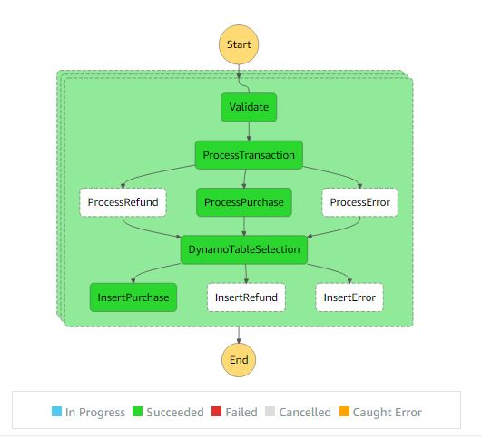

## **Aws Step Functions Example With Lambda And Dynamodb**

------------

### 1. State file embeded

### Lines to change on cfn-template-state-embeded.yaml file.
Add your region and Account ID for the StepFunctions Iteration resource.

    "Validate": {
                        "Type": "Task",
                        "Resource": "arn:aws:lambda:Region:AccountID:function:StepFunctionsIteration",
                        "Next": "ProcessTransaction"
                      },

Enter your Lambda Function ARN string and you are good to go.

                      "ProcessRefund": {
                        "Type": "Task",
                        "Resource": "Enter your lambda function arn here",
                        "Next": "DynamoTableSelection"
                      },
                      "ProcessPurchase": {
                        "Type": "Task",
                        "Resource": "Enter your lambda function arn here",
                        "Next": "DynamoTableSelection"
                      },

Create new stack and deploy cloudformation template.
#### Parameters:
ProjectName: Set your project name.

###2. State file uploaded to the S3 bucket.
### Lines to change on state.json file before uploading to S3 Bucket.
Add your region and Account ID for the StepFunctions Iteration resource.

    "Validate": {
                        "Type": "Task",
                        "Resource": "arn:aws:lambda:Region:AccountID:function:StepFunctionsIteration",
                        "Next": "ProcessTransaction"
                      },

Enter your Lambda Function ARN string and you are good to go.

                      "ProcessRefund": {
                        "Type": "Task",
                        "Resource": "Enter your lambda function arn here",
                        "Next": "DynamoTableSelection"
                      },
                      "ProcessPurchase": {
                        "Type": "Task",
                        "Resource": "Enter your lambda function arn here",
                        "Next": "DynamoTableSelection"
                      },

Create new S3 bucket in the same region and upload state.json file.
Create new CloudFormation stack and deploy template.
#### Parameters:
ProjectName: Set your project name.

StateFileLocation: S3 Bucket name where your state file resides.

StateFileName: Your state file name with extension.

